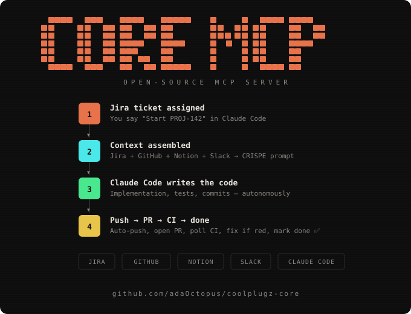

# Core MCP

<p align="center">
  
</p>

### 🏆 Went Kind of Viral Product Hunt & Reddit


<p align="center">
  <a href="https://www.producthunt.com/@cryptosymposium">
    
  </a>
</p>

<p align="center">
  

</p>


MCP tools that turn Jira tickets into PRs through Claude Code. Fetches context from Jira, GitHub, Notion, and Slack, builds structured prompts, handles git push/PR/CI — all autonomously.

## Setup (5 minutes)

### 1. Install

```bash
git clone https://github.com/adaOctopus/coolplugz-core.git
cd coolplugz-core
npm install
```

### 2. Create your `.env`

```bash
cp .env.example .env
```

Open `.env` and fill in:

**Required:**

| Variable | Where to get it |
|----------|----------------|
| `GITHUB_TOKEN` | [github.com/settings/tokens](https://github.com/settings/tokens) → Generate classic token → check `repo` + `workflow` |
| `SHELL_ENV` | Your dev environment: `wsl2`, `macos`, `linux`, `git-bash`, or `powershell` |
| `REPOS_ROOT` | Absolute path where your repos live, e.g. `/home/you/projects` |

**Optional (but recommended):**

| Variable | Where to get it |
|----------|----------------|
| `JIRA_API_TOKEN` | [id.atlassian.com/manage-profile/security/api-tokens](https://id.atlassian.com/manage-profile/security/api-tokens) |
| `JIRA_EMAIL` | Your Atlassian account email |
| `JIRA_BASE_URL` | Your workspace URL, e.g. `https://yourteam.atlassian.net` |
| `NOTION_TOKEN` | [notion.so/my-integrations](https://www.notion.so/my-integrations) → Create integration → copy token |
| `SLACK_TOKEN` | [api.slack.com/apps](https://api.slack.com/apps) → Create app → Bot Token with `channels:history`, `search:read` |
| `ANTHROPIC_API_KEY` | Enables AI-powered repo detection from ticket text and smart Slack reply drafts |
| `WSL_DISTRO` | Only if `SHELL_ENV=wsl2` — your distro name (e.g. `Ubuntu`) |

### 3. Start the server

```bash
npm run dev
```

You should see:
```
CoolPlugz Core MCP server listening on :3100
```

### 4. Connect to Claude Code (one time)

```bash
claude mcp add coolplugz --transport http http://localhost:3100/mcp
```

### 5. Use it

Open Claude Code and say:

```
Show my dashboard
```
```
Start PROJ-142
```

That's it. CoolPlugz handles the rest.

---

## What Happens When You Use It

```
You: "Start PROJ-142"

CoolPlugz:
  ├── Fetches Jira ticket (description, acceptance criteria, comments)
  ├── Checks GitHub for existing branches/PRs
  ├── Pulls linked Notion specs
  ├── Finds relevant Slack mentions
  ├── Figures out which repo (from ticket links or fuzzy matching)
  ├── Builds a CRISPE implementation prompt
  └── Returns loop metadata → Claude Code knows exactly what to do next

Claude Code: writes the code, runs tests

You: (or Claude Code automatically calls push_branch)

CoolPlugz:
  ├── Pushes via token-authenticated HTTPS (no SSH needed)
  ├── Handles fork detection/creation automatically
  └── Returns next action → verify_and_submit

CoolPlugz (verify_and_submit):
  ├── Verifies push landed on GitHub (via API, not trusting output)
  ├── Opens PR with correct title/body
  ├── Polls CI for up to 5 minutes
  ├── If CI passes + no review comments → auto-marks DONE
  ├── If CI fails → fetches failure logs, tells Claude Code to fix
  └── If review comments → fetches them, tells Claude Code to address
```

## Available Tools

| Tool | What it does |
|------|-------------|
| `get_dashboard` | Shows all your tasks with status, PRs, and blockers |
| `start_task` | Fetches all context for a Jira ticket and returns the implementation prompt |
| `push_branch` | Pushes your branch to GitHub — handles auth, forks, everything |
| `verify_and_submit` | Verifies push, creates PR, polls CI, auto-completes if green |
| `check_comments` | Fetches unresolved PR review comments to address |
| `complete_task` | Marks a task done after verification |
| `get_task_state` | Shows ground truth state from the store + GitHub API |
| `check_conflicts` | Detects merge conflicts and gives resolution steps |
| `add_insight` | Adds a custom instruction included in all future prompts |
| `morning_report` | Generates a formatted status report with completed tasks, PRs, CI results, and Slack draft messages |
| `log_run` | Tracks run start/finish — powers morning_report with real data from each scheduled run |

## Custom Instructions

Tell Claude Code to add instructions that CoolPlugz will include in every future prompt:

```
"Add an insight: always use pnpm, never npm or yarn"
"Add an insight: this repo uses Tailwind, no inline styles"
"Add an insight for PROJ-142: the auth module uses Passport.js"
```

Global insights apply to all tasks. Task-scoped insights apply to one ticket. Stored in `~/.coolplugz/data.json` and persist across sessions.

## How the Prompt Builder Works

Every `start_task` builds a structured prompt using the CRISPE framework:

| Section | What's in it |
|---------|-------------|
| **[C] Capacity** | Role, repo, branch, workspace setup (WSL2/macOS/Linux), local paths |
| **[R] Insight** | Full ticket description, AC, Jira comments, Notion specs, Slack context, PR review comments |
| **[I] Statement** | The specific implementation instruction |
| **[S] Personality** | Code style, commit conventions (`feat(PROJ-142): ...`), communication rules |
| **[P] Experiment** | Autonomous execution permissions, loop engineering instructions, safety constraints |
| **[F] Fence** | Never delete, never push to main, never commit secrets |
| **[Q] Quality** | Type safety, surgical changes, security defaults |
| **[D] Developer insights** | Your custom instructions (from `add_insight`) |
| **[E] Error context** | Previous failure details on retries |

## Loop Engineering

Every tool response carries structured metadata instead of free-text checklists:

```
State: EXECUTING → Goal: DONE
Next: push_branch({ jiraKey: "PROJ-142", branch: "proj-142-impl", repo: "org/repo" })
```

Claude Code reads this and calls the next tool automatically. The state machine:

```
IDLE → start_task → EXECUTING → push_branch → PUSHED → verify_and_submit
  → CI passed, no comments → DONE ✅
  → CI failed → fix code → push_branch → verify_and_submit (loop)
  → Review comments → fix → push_branch → verify_and_submit (loop)
```

## Autopilot Prompt

Once everything is connected, paste this prompt into Claude Code to have it run your tickets on autopilot — looping through Jira, writing code, pushing PRs, and posting Slack updates:

```
You are my autonomous dev agent. Use the coolplugz MCP tools to work through my Jira tickets without asking me anything.

Your loop:
1. Call get_dashboard to see all tasks and their status
2. For any task in QUEUED or EXECUTING state, call start_task with its Jira key
3. Follow the loop metadata exactly — the _meta.loop in each response tells you the next tool to call
4. After writing code and running tests, call push_branch to push
5. Call verify_and_submit — it opens the PR, polls CI, and tells you what to do next
6. If CI fails, read the failure logs, fix the code, and push again
7. If there are review comments, call check_comments, address them, push again
8. When done with a task, move to the next one from the dashboard
9. After completing all tasks, post a summary of what you did

Rules:
- Never ask me for confirmation — just do it
- Never push to main — always use feature branches
- Never commit secrets or .env files
- If you get stuck after 3 retries, mark it blocked and move on
- Commit messages follow: feat(TICKET-KEY): description
```

### Schedule it (runs even when your laptop is closed)

Paste this into Claude Code to set up a daily schedule that runs your tickets automatically:

```
Set up a scheduled task using /schedule that runs every weekday:

- 6:00 AM: Morning run
  1. Call log_run with action "start" and trigger "morning" — save the run_id
  2. Call get_dashboard to see all tasks
  3. For every QUEUED ticket, call start_task with its Jira key
  4. Follow the loop metadata for each: code → push_branch → verify_and_submit
  5. If CI fails, fix and retry up to 3 times
  6. When all tasks are processed, call log_run with action "finish", the run_id, and all task_results
  7. Call morning_report with mode "latest" and slack_channels ["standup", "engineering"]
  8. Show me the full report output

- 12:00 PM: Midday check
  1. Call log_run with action "start" and trigger "midday"
  2. Call get_dashboard — for any task stuck in EXECUTING or CI_FAILED, retry it
  3. For tasks with review comments, call check_comments, address them, push again
  4. Call log_run with action "finish" with results
  5. Call morning_report with mode "latest"

- 5:00 PM: End of day
  1. Call log_run with action "start" and trigger "evening"
  2. Call get_dashboard and process any remaining tasks
  3. Call log_run with action "finish" with results
  4. Call morning_report with mode "today" and slack_channels ["standup", "engineering", "product"]
  5. Show me the full report — I want to see what got done today

Rules for all runs:
- Use the coolplugz MCP tools
- Never ask for confirmation — just do it
- Never push to main — always feature branches
- Never commit secrets or .env files
- If stuck after 3 retries, mark blocked and move on
- Commit messages: feat(TICKET-KEY): description
- Always call log_run start/finish so morning_report has real data
```

### View the report anytime

You can also call the report manually in Claude Code:

```
Call morning_report with mode "today" and slack_channels ["standup", "engineering"]
```

Modes:
- `latest` — shows the most recent run's results (default)
- `today` — shows all tasks updated today
- `full` — shows everything in the store

## Environment Variables Reference

### Required

| Variable | What it does | How to get it |
|----------|-------------|---------------|
| `GITHUB_TOKEN` | Pushes branches, opens PRs, reads repo state, polls CI | [github.com/settings/tokens](https://github.com/settings/tokens) → Generate classic token → check **`repo`** + **`workflow`** scopes |
| `SHELL_ENV` | Tells CoolPlugz how to run shell commands in your environment | One of: `wsl2`, `macos`, `linux`, `git-bash`, `powershell` |
| `REPOS_ROOT` | Where your repos are cloned locally | Absolute path, e.g. `/home/you/projects` or `C:\Users\you\repos` |

### Jira (enables ticket context)

| Variable | What it does | How to get it |
|----------|-------------|---------------|
| `JIRA_API_TOKEN` | Fetches ticket description, acceptance criteria, comments | [id.atlassian.com/manage-profile/security/api-tokens](https://id.atlassian.com/manage-profile/security/api-tokens) → Create API token |
| `JIRA_EMAIL` | Authenticates with Jira (Basic auth = email:token) | Your Atlassian account email |
| `JIRA_BASE_URL` | Your Jira instance URL | e.g. `https://yourteam.atlassian.net` |

### GitHub (already covered by GITHUB_TOKEN above)

The `GITHUB_TOKEN` handles everything: reading repos, pushing branches, opening PRs, polling CI status, fetching review comments, detecting forks.

**Scopes needed:** `repo` (full repo access) + `workflow` (trigger/read CI)

### Notion (enables spec fetching)

| Variable | What it does | How to get it |
|----------|-------------|---------------|
| `NOTION_TOKEN` | Pulls linked Notion docs into the CRISPE prompt as reference context | [notion.so/my-integrations](https://www.notion.so/my-integrations) → Create integration → Copy "Internal Integration Secret" → Share target pages with the integration |

### Slack (enables mention tracking + draft replies)

| Variable | What it does | How to get it |
|----------|-------------|---------------|
| `SLACK_TOKEN` | Tracks mentions of your tickets in Slack, drafts AI replies | [api.slack.com/apps](https://api.slack.com/apps) → Create New App → OAuth & Permissions → Add scopes: **`channels:history`**, **`search:read`** → Install to workspace → Copy **Bot User OAuth Token** (`xoxb-...`) |

### AI features (optional)

| Variable | What it does | How to get it |
|----------|-------------|---------------|
| `ANTHROPIC_API_KEY` | Powers smart repo detection from ticket text + AI-drafted Slack replies | [console.anthropic.com](https://console.anthropic.com) → API Keys → Create Key |

### Workspace (optional)

| Variable | What it does | When needed |
|----------|-------------|-------------|
| `WSL_DISTRO` | Your WSL2 distro name for path translation | Only if `SHELL_ENV=wsl2` (e.g. `Ubuntu`) |
| `PORT` | MCP server port | Default: `3100` — change if port is taken |

## Data Storage

All data lives in `~/.coolplugz/data.json` — tasks, context snapshots, repo mappings, insights, prompt history. No database required. Delete the file to start fresh.

## Architecture

```
src/
├── index.ts              # MCP server (Express + StreamableHTTP)
├── config.ts             # Reads tokens from .env
├── store.ts              # JSON file store (~/.coolplugz/data.json)
├── lib/
│   ├── loopState.ts      # State machine
│   └── response.ts       # mcpText() and mcpLoop() builders
├── context/
│   ├── jira.ts           # Jira fetcher (Basic auth)
│   ├── github.ts         # GitHub state (branches, PRs, CI)
│   ├── notion.ts         # Notion doc fetcher
│   ├── slack.ts          # Slack mentions + AI draft replies
│   ├── repoResolver.ts   # Auto-detect repo from ticket content
│   └── assemble.ts       # CRISPE prompt builder
├── orchestrator/
│   └── githubApi.ts      # GitHub API helpers
└── tools/
    ├── orchestrator.ts   # start_task, verify_and_submit, etc.
    ├── pushBranch.ts     # Token-authenticated push + fork handling
    ├── getDashboard.ts   # Text dashboard
    └── addInsight.ts     # Custom instruction management
```

## License

MIT
